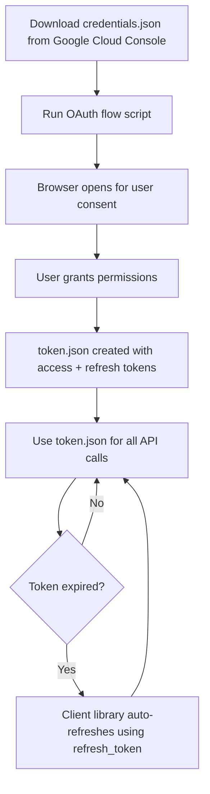

# Google OAuth Files Explained

## Two Separate Files

Google OAuth authentication uses **two distinct JSON files** with different purposes. Understanding the difference prevents common confusion.

## credentials.json (OAuth Client Metadata)

### Purpose
Holds OAuth 2.0 client application metadata from Google Cloud Console.

### Contents
```json
{
  "installed": {
    "client_id": "YOUR_CLIENT_ID.apps.googleusercontent.com",
    "client_secret": "YOUR_CLIENT_SECRET",
    "redirect_uris": ["http://localhost"],
    "auth_uri": "https://accounts.google.com/o/oauth2/auth",
    "token_uri": "https://oauth2.googleapis.com/token"
  }
}
```

### Key Fields
- **`client_id`**: Your OAuth app's client ID
- **`client_secret`**: Your OAuth app's client secret (keep private but not as sensitive as refresh token)
- **`redirect_uris`**: Allowed redirect URLs (usually localhost for desktop apps)

### How to Get It
1. Go to [Google Cloud Console](https://console.cloud.google.com)
2. Navigate to **APIs & Services** → **Credentials**
3. Click **Create Credentials** → **OAuth 2.0 Client ID**
4. Select **Desktop app** application type
5. Download the JSON file and rename to `credentials.json`

### Security Level
**Medium sensitivity**: Contains client secret but NOT user tokens.
- Share carefully (don't commit to public repos)
- Can be regenerated in Google Cloud Console if compromised

### Location in Agent Zero
`/a0/usr/projects/a0_sip/credentials.json`

---

## token.json (Runtime Access Tokens)

### Purpose
Holds the actual access token and refresh token for API calls after user consent.

### Contents
```json
{
  "token": "ya29.a0AfH6SMBx...",
  "refresh_token": "1//0gK...",
  "token_uri": "https://oauth2.googleapis.com/token",
  "client_id": "YOUR_CLIENT_ID.apps.googleusercontent.com",
  "client_secret": "YOUR_CLIENT_SECRET",
  "scopes": [
    "https://www.googleapis.com/auth/gmail.send",
    "https://www.googleapis.com/auth/gmail.readonly",
    "https://www.googleapis.com/auth/drive",
    "https://www.googleapis.com/auth/spreadsheets",
    "https://www.googleapis.com/auth/presentations"
  ],
  "expiry": "2026-03-04T12:34:56Z"
}
```

### Key Fields
- **`token` / `access_token`**: Short-lived access token (expires in ~1 hour)
- **`refresh_token`**: Long-lived refresh token (used to get new access tokens)
- **`expiry`**: When the current access token expires (ISO 8601 timestamp)
- **`scopes`**: Authorized OAuth scopes (permissions granted by user)

### How It's Created
1. User runs OAuth flow (e.g. `gmail_oauth.py`)
2. Browser opens for user consent
3. User grants permissions
4. OAuth flow creates `token.json` with access and refresh tokens
5. Client libraries auto-refresh when `expiry` is reached

### Security Level
**HIGHLY SENSITIVE**: Contains refresh token which grants long-term access.
- **NEVER** commit to version control
- **NEVER** share publicly
- **NEVER** log or print to console
- Add to `.gitignore`
- Rotate immediately if compromised

### Location in Agent Zero
`/a0/usr/projects/a0_sip/token.json`

---

## Common Confusion

### "credentials file is missing refresh_token"
**This is expected!** `credentials.json` NEVER has `refresh_token`.
- `refresh_token` is in `token.json` (created after OAuth flow)

### "token file is missing client_secret"
**This is expected!** `token.json` NEVER has `client_secret`.
- `client_secret` is in `credentials.json` (downloaded from Google Cloud Console)

### "Where do I get token.json?"
You **create** it by running the OAuth flow:

```bash
# Example OAuth flow script
/opt/venv-a0/bin/python3 /a0/usr/projects/a0_sip/gmail_oauth.py

# This opens a browser for user consent
# After consent, token.json is created automatically
```

### "Do I need both files?"
**Yes**, both are required:
1. `credentials.json` → tells Google which app is requesting access
2. `token.json` → proves the user gave permission to that app

---

## Workflow



### Step-by-Step

1. **Get credentials.json** (one-time setup)
   - Download from Google Cloud Console
   - Place at `/a0/usr/projects/a0_sip/credentials.json`

2. **Run OAuth flow** (one-time per user)
   ```bash
   /opt/venv-a0/bin/python3 /a0/usr/projects/a0_sip/gmail_oauth.py
   ```
   - Browser opens
   - Log in as bill@th3rdai.com
   - Grant permissions
   - `token.json` created automatically

3. **Use APIs** (ongoing)
   ```python
   from google.oauth2.credentials import Credentials
   from googleapiclient.discovery import build

   creds = Credentials.from_authorized_user_file("/a0/usr/projects/a0_sip/token.json")
   gmail = build("gmail", "v1", credentials=creds)
   # Client library auto-refreshes token when expired
   ```

4. **NEVER re-authenticate** unless:
   - `token.json` is deleted
   - Refresh token is revoked (user revokes access in Google Account settings)
   - Scopes change (need additional permissions)

---

## Agent Zero Configuration

### Current Setup

- **Account**: bill@th3rdai.com
- **credentials.json**: `/a0/usr/projects/a0_sip/credentials.json`
- **token.json**: `/a0/usr/projects/a0_sip/token.json`

### Authorized Scopes

```
gmail.send           ✓ Send emails
gmail.readonly       ✓ Read emails
drive                ✓ Google Drive (upload, create folders, share)
spreadsheets         ✓ Google Sheets (read/write)
presentations        ✓ Google Slides (create/edit)
cloud-platform       ✓ Google Cloud Platform APIs
```

### Token Lifespan

- **Access token**: ~1 hour (auto-refreshed)
- **Refresh token**: Indefinite (until revoked)

### Manual Token Refresh

If you need to manually refresh the token:

```python
import json, requests
from datetime import datetime, timezone, timedelta

# Load credentials and token
with open("/a0/usr/projects/a0_sip/credentials.json") as f:
    client_data = json.load(f).get("installed", {})

with open("/a0/usr/projects/a0_sip/token.json") as f:
    t = json.load(f)

# Refresh
resp = requests.post("https://oauth2.googleapis.com/token", data={
    "refresh_token": t["refresh_token"],
    "client_id": client_data["client_id"],
    "client_secret": client_data["client_secret"],
    "grant_type": "refresh_token"
})

# Update token
td = resp.json()
t["token"] = td["access_token"]
t["expiry"] = (datetime.now(timezone.utc) + timedelta(seconds=3600)).strftime("%Y-%m-%dT%H:%M:%SZ")

# Save
with open("/a0/usr/projects/a0_sip/token.json", "w") as f:
    json.dump(t, f)
```

**Note**: Client libraries (google-api-python-client) handle this automatically.

---

## Security Best Practices

### credentials.json
- ✓ Can be version controlled (private repos only)
- ✓ Can be shared with team members
- ✗ Don't commit to public repos
- ✗ Don't share publicly on forums/issues

### token.json
- ✗ **NEVER** version control
- ✗ **NEVER** share with anyone
- ✗ **NEVER** log or print
- ✓ Add to `.gitignore`
- ✓ Rotate if compromised (revoke in Google Account settings)

### Rotating Compromised Tokens

If `token.json` is exposed:

1. Revoke access:
   - Go to https://myaccount.google.com/permissions
   - Find your app
   - Click **Remove Access**

2. Delete local token:
   ```bash
   rm /a0/usr/projects/a0_sip/token.json
   ```

3. Re-run OAuth flow:
   ```bash
   /opt/venv-a0/bin/python3 /a0/usr/projects/a0_sip/gmail_oauth.py
   ```

If `credentials.json` is exposed:

1. Delete OAuth client in Google Cloud Console
2. Create new OAuth client
3. Download new credentials.json
4. Re-run OAuth flow

---

## Related Documentation

- [Google API Integration](../../knowledge/main/google_apis.md)
- [OAuth Setup Guide](./SETUP_GOOGLE_OAUTH.md)
- [Troubleshooting: Venv Recovery](../troubleshooting/venv_recovery.md)

## External Resources

- [Google OAuth 2.0 Documentation](https://developers.google.com/identity/protocols/oauth2)
- [OAuth 2.0 for Desktop Apps](https://developers.google.com/identity/protocols/oauth2/native-app)
- [Google API Client Library for Python](https://github.com/googleapis/google-api-python-client)
