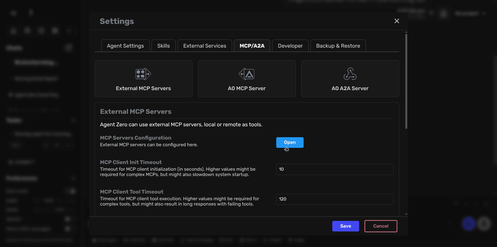
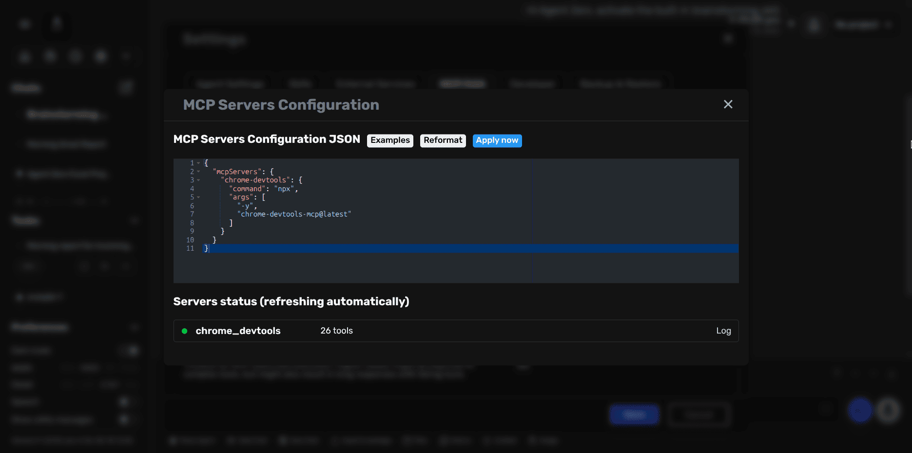

# MCP Server Setup

Agent Zero can connect to external MCP (Model Context Protocol) servers to extend its capabilities with additional tools. This guide shows you how to add MCP servers through the Settings UI.

## What are MCP Servers?

MCP servers are external tools that Agent Zero can use to perform specialized tasks. Popular examples include:

- **Browser automation** (Chrome DevTools, Playwright)
- **Workflow automation** (n8n)
- **Email operations** (Gmail)
- **Database access** (SQLite)

> [!NOTE]
> This guide covers connecting to external MCP servers as a client. For exposing Agent Zero as an MCP server, see the [advanced documentation](../developer/mcp-configuration.md).

## Adding an MCP Server

### Step 1: Open MCP Configuration

1. Click **Settings** in the sidebar
2. Navigate to the **MCP/A2A** tab
3. Click on **External MCP Servers**
4. Click the **Open** button to access the configuration editor



### Step 2: Add Your MCP Server

In the JSON editor, add your MCP server configuration. Here's a simple example:

```json
{
  "mcpServers": {
    "chrome-devtools": {
      "command": "npx",
      "args": ["-y", "chrome-devtools-mcp@latest"]
    }
  }
}
```



### Step 3: Apply and Verify

1. Click **Apply now** to save your configuration
2. The server status will appear below, showing:
   - Server name (e.g., `chrome_devtools`)
   - Number of available tools
   - Connection status (green indicator = connected)

> [!TIP]
> The first time you run an `npx`-based MCP server, it may take a few moments to download and initialize.

## Common MCP Server Examples

### Local Command-Based Server

```json
{
  "mcpServers": {
    "sqlite": {
      "command": "uvx",
      "args": ["mcp-server-sqlite", "--db-path", "/root/db.sqlite"]
    }
  }
}
```

### Remote HTTP Server

```json
{
  "mcpServers": {
    "external-api": {
      "url": "https://api.example.com/mcp",
      "headers": {
        "Authorization": "Bearer YOUR_API_KEY"
      }
    }
  }
}
```

## Google Workspace MCP (full workspace)

For **Gmail, Drive, Docs, Sheets, Slides, Calendar, Tasks, and more** in one MCP server, use [Google Workspace MCP](https://workspacemcp.com/) (`workspace-mcp`). It uses OAuth 2.1 and supports stdio or streamable HTTP.

### Prerequisites

- **Python 3.10+** and **uv** (for `uvx`). In Docker, ensure the image has `uv`/`uvx` or run the server on the host (see HTTP option below).
- **Google OAuth credentials:** Create a Desktop OAuth client in [Google Cloud Console](https://console.cloud.google.com/) (APIs & Services → Credentials). Set:
  - `GOOGLE_OAUTH_CLIENT_ID` — your client ID (e.g. `xxxxx.apps.googleusercontent.com`)
  - `GOOGLE_OAUTH_CLIENT_SECRET` — your client secret

### Option 1: Stdio (local, same machine)

Run the server as a subprocess. Set the env vars in your environment (or in `.env` / container env) so the MCP process can use them. First run may open a browser for OAuth; in headless Docker you may need to complete OAuth on the host and reuse tokens.

```json
{
  "mcpServers": {
    "google_workspace": {
      "description": "Gmail, Drive, Docs, Sheets, Slides, Calendar, Tasks (OAuth required)",
      "command": "uvx",
      "args": ["workspace-mcp", "--tool-tier", "core"],
      "env": {
        "GOOGLE_OAUTH_CLIENT_ID": "your-client-id.apps.googleusercontent.com",
        "GOOGLE_OAUTH_CLIENT_SECRET": "your-client-secret"
      }
    }
  }
}
```

- **Tool tiers:** `--tool-tier core` (recommended), `extended`, or `complete`. Or list services: `--tools gmail drive calendar tasks sheets docs slides`.
- **Read-only:** Add `--read-only` to restrict to read operations.

### Option 2a: Containerized (same stack as Agent Zero) — recommended with Docker Compose

If you run Agent Zero with `docker compose up`, you can run the Workspace MCP as a service in the same stack. No host script needed after one-time OAuth setup.

1. **First-time OAuth:** Run the host script once so a browser can complete Google sign-in, then copy credentials for the container:
   ```bash
   ./scripts/setup/run_workspace_mcp.sh
   # Use a tool (e.g. list emails) to trigger OAuth in the browser, then Ctrl+C
   mkdir -p workspace-mcp-credentials
   cp -r ~/.google_workspace_mcp/* workspace-mcp-credentials/
   ```

2. **Start the stack** (includes `workspace_mcp`): `docker compose up -d`

3. **Add the server in Agent Zero** — **Settings → MCP/A2A → External MCP Servers → Open**. Add:
   ```json
   {
     "mcpServers": {
       "google_workspace": {
         "description": "Gmail, Drive, Docs, Sheets, Slides, Calendar (container)",
         "url": "http://workspace_mcp:8889/mcp",
         "type": "streamable-http"
       }
     }
   }
   ```

See [docker/workspace-mcp/README.md](../../docker/workspace-mcp/README.md) for details.

### Option 2b: Remote HTTP (server on host)

Run the Workspace MCP server on the host, then add the remote server from the **Settings page**:

1. **On the host** — start the server:
   ```bash
   ./scripts/setup/run_workspace_mcp.sh
   ```
   Or: set `GOOGLE_OAUTH_CLIENT_ID` and `GOOGLE_OAUTH_CLIENT_SECRET`, then run `uvx workspace-mcp --transport streamable-http`. Default port 8889; server listens on `http://localhost:8889/mcp`.

2. **Add the server in Agent Zero** — **Settings → MCP/A2A → External MCP Servers → Open**. Use:
   ```json
   {
     "mcpServers": {
       "google_workspace": {
         "description": "Gmail, Drive, Docs, Sheets, Slides, Calendar (remote)",
         "url": "http://host.docker.internal:8889/mcp",
         "type": "streamable-http"
       }
     }
   }
   ```
   Use `host.docker.internal` (macOS/Windows) or the host IP (Linux). Optional: run `./scripts/setup/add_workspace_mcp_remote.sh` to insert this server into settings automatically.

Details, OAuth 2.1 multi-user, and CLI checks: [workspacemcp.com Quick Start](https://workspacemcp.com/quick-start).

## Docker Networking

If Agent Zero runs in Docker and your MCP server runs on the host:

- **macOS/Windows:** Use `host.docker.internal` in URLs
- **Linux:** Run the MCP server in the same Docker network and use the container name

## Using MCP Tools

Once connected, MCP tools become available to Agent Zero automatically. Tools are named with the server prefix, for example:

- Server name: `chrome-devtools`
- Tool becomes: `chrome_devtools.navigate_to_url`

Simply ask Agent Zero to perform tasks, and it will use the appropriate MCP tools when needed.

## Advanced Configuration

For detailed configuration options, server types, environment variables, and troubleshooting, see the [Advanced MCP Configuration Guide](../developer/mcp-configuration.md).

## Recommended MCP Servers

Community-tested and reliable MCP servers:

- **Google Workspace MCP** - Gmail, Drive, Docs, Sheets, Slides, Calendar, Tasks (see [Google Workspace MCP](#google-workspace-mcp-full-workspace) above)
- **Chrome DevTools MCP** - Direct Chrome control
- **Playwright MCP** - Cross-browser automation
- **n8n MCP** - Workflow automation
- **Gmail MCP** - Email-only alternatives
- **VSCode MCP** - IDE workflows

> [!TIP]
> For browser automation tasks, MCP-based browser tools are more reliable than the built-in browser agent.
